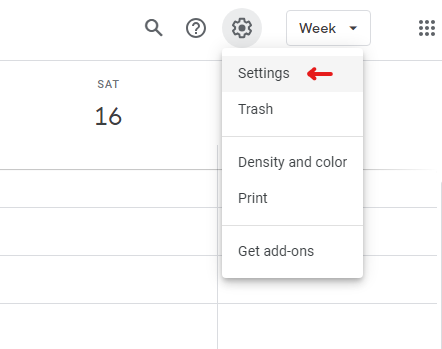
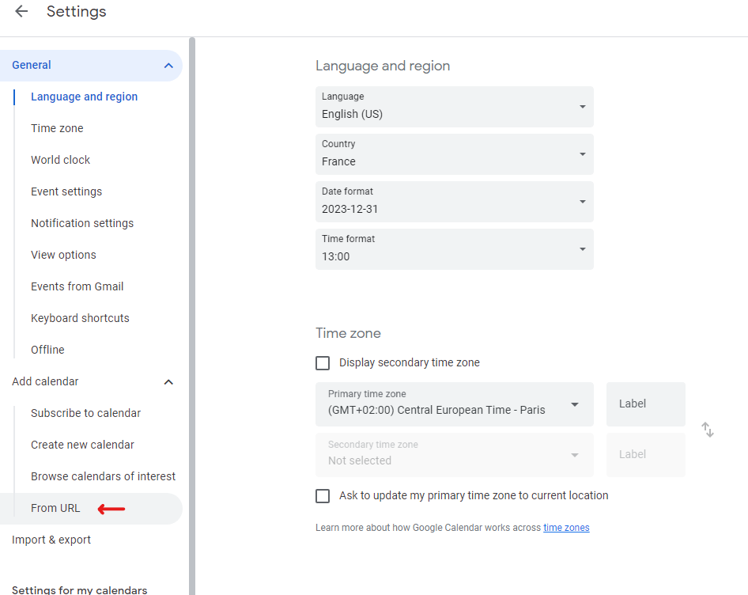
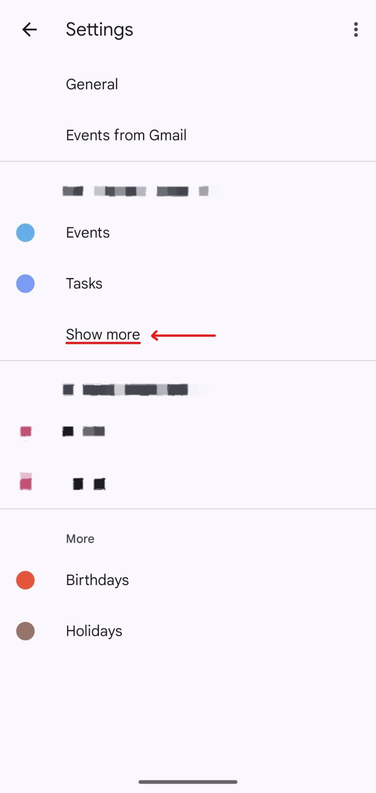
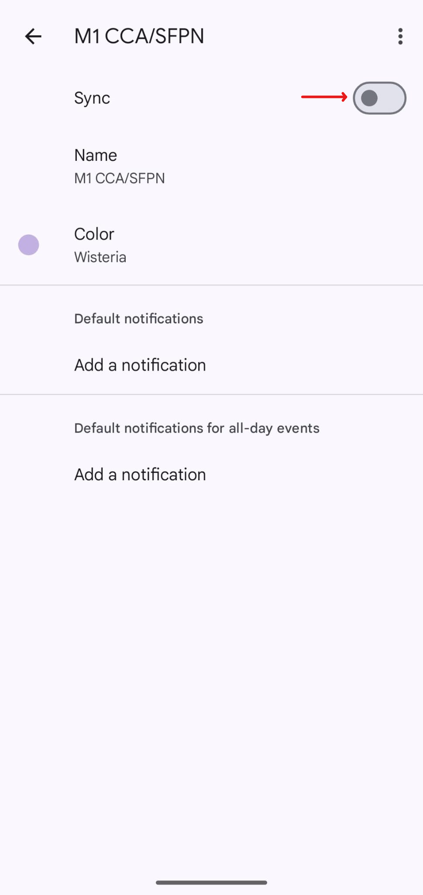

# MasterCal-API
MasterCal serves personalized iCalendars for CS Masters at Sorbonne University, directly in yout Google Calendar.

## Setup
1. Go to [https://mastercal.xyz](https://mastercal.xyz)
2. Fill in your major and your courses (starting with the major) and copy your personal generated link
3. Open [Google Calendar](https://calendar.google.com/) or any other calendar app that supports importing and syncing from URL (I will use Google Calendar in the setup)
4. In the upper right corner of your screen, click the gear icon on the left of your Google account profile picture and choose _Settings_
   
   

     
   

   
6. On the left of your screen, unwrap the _Add calendar_ submenu and click _From URL_
   
   

     
   

8. Fill in the link you copied and add the calendar. It's going to load for a bit because it's downloading all events
9. (Optional) You can customize the name and color of your calendar
11. ⚠️ Now head to your Google Calendar phone app and open settings
12. ⚠️ Under the Google account you used, click _Show more_. Your new calendar is hidden there. Press the calendar item you just created
13. ⚠️ Finally, press _Sync_ to enable syncing on your phone. Voilà!
        
   

     
     
   

If you have any comment or if you find a mistake somewhere (wrong course code, duplicate, etc.) please send me a message on Discord! The @ is my username. 
